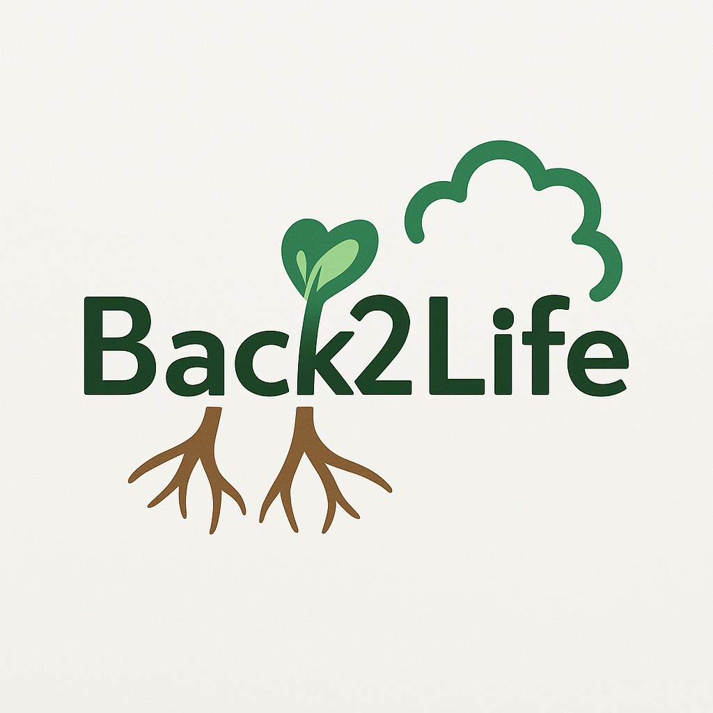

# Back2Life 🌱

A rehabilitation companion app that helps users recover through the joy of nurturing virtual plants.



## 🌟 Overview

Back2Life is a mobile-first web application designed to make the rehabilitation journey more engaging and rewarding. By connecting physical recovery with digital growth, patients can visualize their progress through a virtual garden that flourishes as they complete their exercises and wellness activities.

Developed during a 24-hour hackathon, this project aims to address the challenge of maintaining motivation during long-term rehabilitation by gamifying the recovery process.

[Video of the app](https://drive.google.com/file/d/11NrC3eSNtyc_BfefytDpW9gNPW7sgi7o/view?usp=sharing) 

## ✨ Features

### Physical Rehabilitation
- Personalized rehabilitation plans based on injury type
- Daily exercise tracking and reminders
- Visual representation of recovery progress

### Mental Wellness
- Prompts for mental health activities (getting out of bed, opening windows, social interactions)
- Positive reinforcement through plant growth and messages
- Stress and anxiety tracking over time

### Community & Gamification
- Track progress of other rehabilitation users
- Send gifts to fellow patients
- Earn coins by completing exercises and activities
- Use coins to care for your virtual garden

### Progress Tracking
- Detailed metrics visualizations (therapy time, outdoor time, steps, anxiety levels)
- Export data in CSV or PDF format for healthcare professionals
- Weekly and monthly progress views

## 🖥️ Technologies

- **Frontend**: Next.js, React, TypeScript
- **UI Components**: shadcn/ui
- **Styling**: Tailwind CSS
- **Data Visualization**: Recharts
- **State Management**: React Hooks (useState, useEffect)

## 🏗️ Project Structure

```
back2life/
├── app/                       # Next.js pages and layouts
│   ├── game/                  # Game-related pages
│   │   ├── garden/            # Virtual garden interface
│   │   └── seed-selection/    # Plant selection page
│   ├── login/                 # User authentication
│   ├── register/              # User registration
│   ├── rehabilitation/        # Rehab plan setup
│   └── progressChart/         # Progress visualization
├── components/                # Reusable UI components
├── public/                    # Static assets
│   └── images/                # App images and icons
└── styles/                    # Global styles
```

## 🚀 Getting Started

### Prerequisites

- Node.js 18.x or higher
- npm or yarn

### Installation

1. Clone the repository:
   ```bash
   git clone https://github.com/yourusername/back2life.git
   cd back2life
   ```

2. Install dependencies:
   ```bash
   npm install
   # or
   yarn install
   ```

3. Run the development server:
   ```bash
   npm run dev
   # or
   yarn dev
   ```

4. Open [http://localhost:3000](http://localhost:3000) in your browser.

## 📱 Mobile-First Design

Back2Life is designed with a mobile-first approach, making it easy to use on smartphones and tablets during rehabilitation sessions. The app uses responsive design principles to ensure a good experience across all device sizes.

## 🌿 User Journey

1. **Registration**: User creates an account and provides basic information
2. **Rehab Setup**: User specifies their injury type and receives personalized exercises
3. **Seed Selection**: User chooses a plant to grow throughout their rehabilitation journey
4. **Daily Interaction**: User completes exercises, earns coins, and nurtures their plant
5. **Progress Tracking**: User monitors their rehabilitation metrics and plant growth
6. **Community**: User interacts with other patients on similar journeys

## 🔮 Future Enhancements

- Integration with physical activity trackers and wearables
- AI-powered exercise form analysis via device camera
- Expanded garden with more plant varieties and customization options
- Guided meditation and mindfulness exercises
- Direct communication with healthcare providers

---

Developed with 💚 during the [Hackathon BGU] in 2025.
